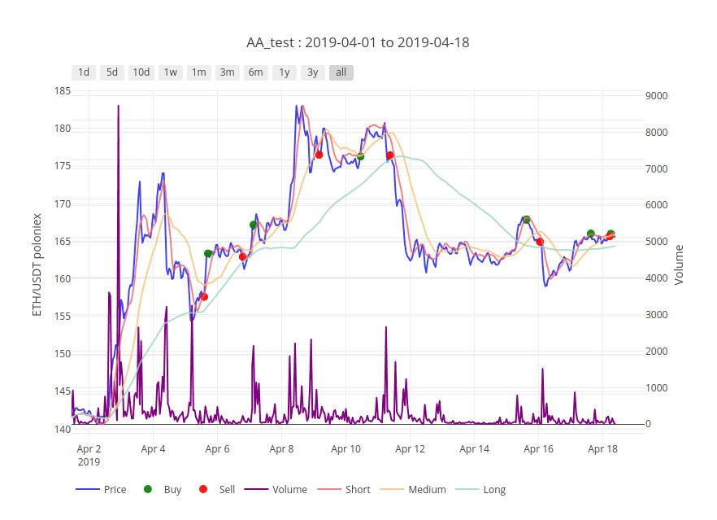
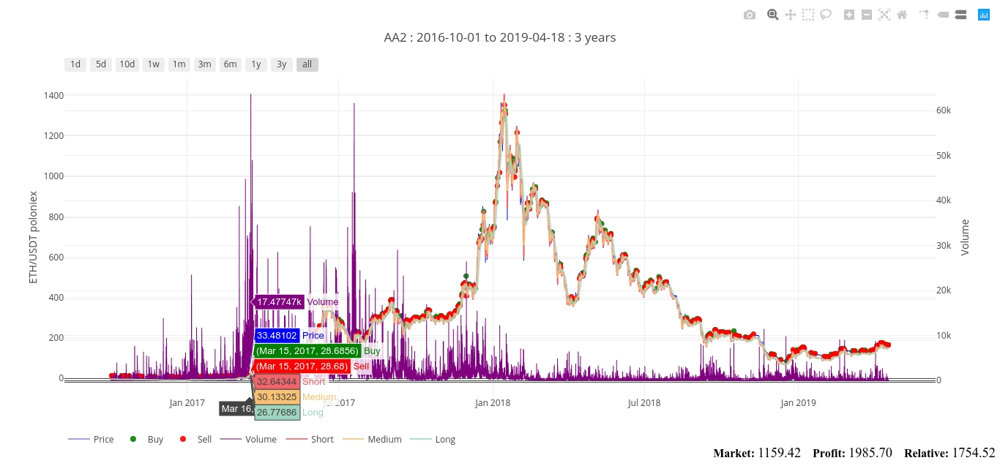

This plugin can be used when running [Gekko](https://github.com/askmike/gekko) backtests from the command line.

## Installation

1. Add `plugins/plotly.js` to your Gekko plugins folder
2. `npm install --save-dev ramda@0.26.1`
3. Add this to `plugins.js`:

```javascript
{
    name: "Plotly",
    description: "Plots Gekko data onto a Plotly chart for easier analysis",
    slug: "plotly",
    async: false,
    modes: ["backtest"]
},
```

4. Add this to your `{{config}}.js` file:

```javascript
config.plotly = {
    enabled: true
};
```

5. Run the backtest
6. Open `plot.html` in your web browser

## Configuration

To override the default settings, you can add to your `config.plotly`. Here are the defaults:

```javascript
{
    write: {
        enabled: true,
        path: ""
    },
    performanceReport: {
        enabled: true,
        items: []
    },
    css: {
        additional: ""
    },
    layout: {
        autosize: true,
        height: 620,
        width: null,
        legendOrientation: "h",
        buttons: {
            day: [1, 5, 10],
            week: [1],
            month: [1, 3, 6],
            year: [1, 3]
        },
        additional: {}
    },
    data: {
        price: {
            enabled: true,
            color: "blue",
            width: 2,
            opacity: 0.75
        },
        trades: {
            enabled: true,
            buy: {
                color: "green",
                opacity: 0.9,
                size: 10
            },
            sell: {
                color: "red",
                opacity: 0.9,
                size: 10
            }
        },
        volume: {
            enabled: true,
            color: "purple",
            width: 2,
            opacity: 0.8
        },
        strategy: {
            enabled: true,
            indicators: {}
        }
    }
}
```

Note that the `config.plotly.data.strategy.indicators` object is empty. This is where you can point to the indicators of your strategy that you want to plot. The format of this object is:

```javascript
{
    Long: {
        path: ["long"],
        color: "#9DD5C0",
        width: 2,
        opacity: 0.8,
        yaxis: 1
    },
    Medium: {
        path: ["medium"],
        color: "#FAC174",
        width: 2,
        opacity: 0.8,
        yaxis: 1
    },
    Short: {
        path: ["short"],
        color: "#F1646C",
        width: 2,
        opacity: 0.8,
        yaxis: 1
    }
}
```

The `path` is an array that points to the indicator data columns that your strategy writes to. It is the same as using dot notation, but uses an array format (see [Ramda lensPath](https://ramdajs.com/docs/#lensPath)). Most strategies write indicator data that doesn’t involve any nested values, so you probably won’t have to write `path` arrays that are more than one item long.

Also, the `yaxis` properties need explanation. These can be set to either the same number as each other or different numbers to determine whether your indicators will share the same y-axis or different ones.

Also, you can add items from the performance report to the bottom of the screen like so:

```
performanceReport: {
    enabled: true,
    items: [
        ["Market", "market"],
        ["Profit", "profit"],
        ["Relative", "relativeProfit"]
    ]
},
```

where the second item in each pair is the property name within `data.stats.performanceReport`.
